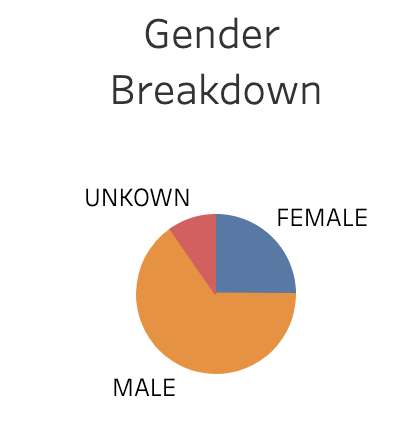

# Bike Sharing Analysis

## Overview
I have created a story with the use of Tableau to write a report that describes the data from CitiBike Data of August 2019. With the use of Tableau's visualization tools I have different graphs, sheets, dashboard that allow us to have some insights into the data. 

[Tableau Story](https://public.tableau.com/app/profile/akinsola.salami/viz/bikesharingchallenge_16229454518550/AugustCitiBikeData)

## Results 
   

We completed 2,344,224 rides in the month of August wchich is very impressive. About 1.9 million rides were completed by subscribers which is 80% off the total rides in the month. 

  

This line graph allows us to visualize how consumers are using CitiBike's service. From the graph above we see that consumers are not usually biking for more than 2 hours at a time. We have more male users than other genders.

Still understanding consumer behaviour, we can see the busiest time for CitiBike. Subscribers used the CitiBike more on Thursdays than any other day. Normal customers utlize CitiBikes more on saturday, which is very reasonable for leisure activities. 

In order to plan a maintenace schedule. We have visualized the per hour usage in a histogram from August. This lets us know what are the best times. Maintenance is best done between 12am to 5am.

## Summary
Overall our analysis proved to be very useful. We are able to understand how customers like to use CitiBikes, average duration of rides and give us a general idea of maintenance. Additional graphs that could be added included:
1. A customer breakdown for other months to see when the best time to launch may be. Understading when we have our highest amount of subscribers 
1. It would be very interesting the amount of bikes in each station and based on usage from certain stations we can have more bikes parked in some stations.  
